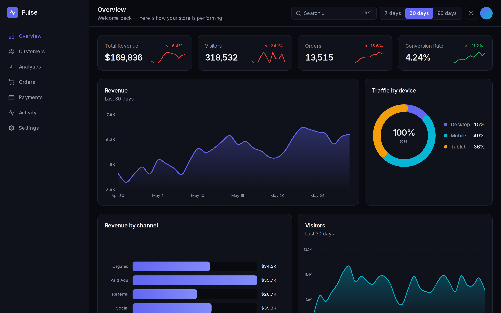
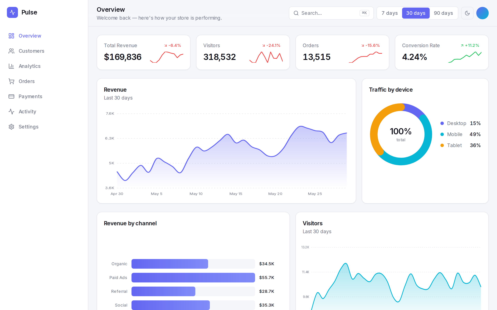
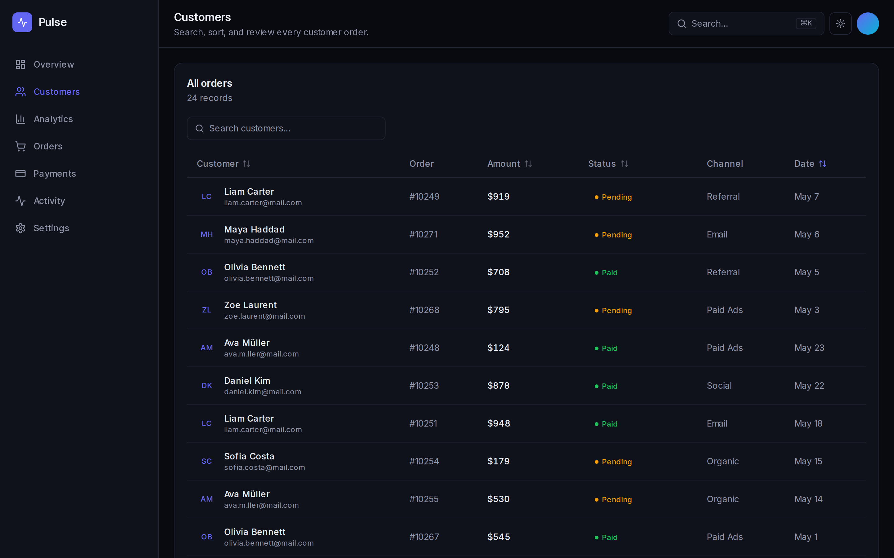

<div align="center">

# 📊 Pulse — Analytics Dashboard

**A premium analytics dashboard with charts built entirely from scratch — no chart library.**

Next.js 14 · TypeScript · Tailwind CSS · Framer Motion


</div>

---

## 📸 Screenshots

### Overview (dark)


### Overview (light)


### Customers — sortable, searchable table


---

## ✨ Highlights

- **Custom-built charts, zero chart libraries** — the area chart (smooth
  Catmull-Rom curves, gradient fill, animated draw, hover crosshair + tooltip),
  donut, bar chart, and sparklines are all hand-coded SVG.
- **Interactive date ranges** — 7 / 30 / 90 days recompute every KPI, chart, and
  trend delta.
- **Animated KPI counters** with period-over-period deltas and sparklines.
- **Sortable & searchable data table** with status badges and avatars.
- **Dark / light mode** (theme-aware CSS variables), defaults to dark.
- **Skeleton loaders**, smooth transitions, and micro-interactions throughout.
- **Fully responsive** — collapsible mobile sidebar, horizontal-scroll tables.
- **Zero backend** — a deterministic, range-aware data engine runs in-process,
  so it deploys free anywhere with no API keys.

## 🛠️ Tech Stack

| Layer     | Tech                                            |
| --------- | ----------------------------------------------- |
| Framework | [Next.js 14](https://nextjs.org/) (App Router)  |
| Language  | [TypeScript](https://www.typescriptlang.org/)   |
| Styling   | [Tailwind CSS](https://tailwindcss.com/) + CSS vars |
| Charts    | Custom SVG (no dependency)                       |
| Motion    | [Framer Motion](https://www.framer.com/motion/) |
| Icons     | [Lucide](https://lucide.dev/)                   |

## 🏗️ Structure

```
src/
├── app/
│   ├── page.tsx              # Overview (KPIs, charts, recent orders)
│   ├── customers/page.tsx    # Sortable / searchable orders table
│   └── layout.tsx
├── components/
│   ├── dashboard/
│   │   ├── area-chart.tsx    # Custom SVG area chart + tooltip
│   │   ├── bar-chart.tsx     # Animated bar chart
│   │   ├── donut-chart.tsx   # SVG donut + legend
│   │   ├── sparkline.tsx
│   │   ├── stat-card.tsx     # KPI card w/ animated count-up
│   │   ├── orders-table.tsx  # Sort + search
│   │   ├── sidebar.tsx       # Desktop + animated mobile drawer
│   │   ├── topbar.tsx · shell.tsx · range-filter.tsx · skeleton.tsx
│   └── ui/ · theme-provider · theme-toggle
├── hooks/use-count-up.ts
└── lib/
    ├── data.ts               # Deterministic, range-aware data engine
    └── utils.ts              # Formatters + helpers
```

## 🧑‍💻 Getting Started

```bash
npm install
npm run dev      # no API keys required
```

Open [http://localhost:3000](http://localhost:3000).

## ☁️ Deployment

Push to GitHub and import on [Vercel](https://vercel.com/) — no environment
variables needed.

## 📄 License

MIT
